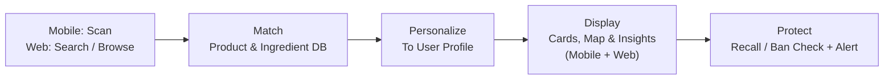
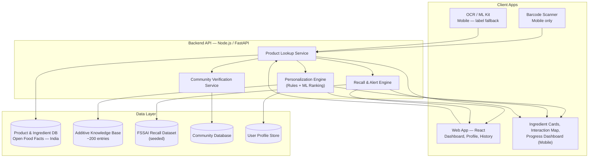

# Nutri Lens

### AI-Powered Food Label & Ingredient Intelligence Platform

> *Scan. Understand. Choose Better.*

Nutri Lens turns a five-second barcode or label scan into plain-language, personalized food-safety intelligence — explaining not just **what's** in a product, but **why** it's there, and what it means for the person scanning it.


**Team:** CODESTRIX

*Platform note: Nutri Lens ships as both a **mobile app** (Android & iOS) and a **companion web app**. Scanning happens on mobile; the web app covers dashboard, profile, and scan history. Institution-specific bulk-audit features on the web app are a Phase 10 roadmap item — see [Phase 10](#extended-roadmap-proposed-features).*

---

## Table of Contents

1. [Overview](#overview)
2. [The Problem](#the-problem)
3. [The Solution](#the-solution)
4. [Core Features (MVP Scope)](#core-features-mvp-scope)
5. [Extended Roadmap (Proposed Features)](#extended-roadmap-proposed-features)
6. [Tech Stack](#tech-stack)
7. [System Architecture](#system-architecture)
8. [Data Sources & Strategy](#data-sources--strategy)
9. [Feasibility & Current Build Status](#feasibility--current-build-status)
10. [Competitive Landscape](#competitive-landscape)
11. [Target Users & Personas](#target-users--personas)
12. [Impact & SDG Alignment](#impact--sdg-alignment)
13. [Business Model & Roadmap Timeline](#business-model--roadmap-timeline)
14. [Risks & Honest Notes](#risks--honest-notes)
15. [Project Status](#project-status)
16. [Repository Structure](#repository-structure)
17. [Getting Started & Git Workflow](#getting-started--git-workflow)
18. [Team](#team)
19. [License](#license)

---

## Overview

India's packaged food market has grown far faster than its food literacy. Ingredient lists are printed in regulatory language almost no shopper can decode, nutrition advice on most apps is rarely personalized to a real medical condition, and once a product is recalled there's no way for someone who already bought it to find out.

**Nutri Lens** is a mobile *and* web platform that closes that gap. Scan a barcode or label on mobile and get back:

- A plain-language explanation of every ingredient — what it is, why it's there, and what it means for *your* body
- Advice personalized to your age, health conditions, allergies, and goals
- A side-by-side comparison against similar products
- A retroactive alert if something you've already bought is later recalled or banned

The **web app** mirrors your profile, scan history, and dashboard in the browser — same account, same data, no scanning hardware required to check in on your progress.

Originally developed as a submission for **Smart India Hackathon 2026** (Theme: FoodTech / Public Health) by **Team CODESTRIX**.

---

## The Problem

| Statistic | What It Means |
|---|---|
| **~40×** | Growth in ultra-processed food sales in India, 2006–2019 (Lancet-reported) |
| **52.5%** | Of nutrient & health claims on Indian packaged food found non-compliant (LabelBlind / Nutrition Insight audit, 2026) |
| **0** | Mandatory front-of-pack warning labels required in India today |

**Why existing tools fall short:**
- **Jargon barrier** — labels list additive codes like "INS 211" that almost no shopper can interpret
- **One-size-fits-all advice** — the same product is scored identically for everyone, regardless of a person's actual health profile
- **No post-purchase safety net** — once a product is recalled or banned, there's no mechanism to tell someone who already bought it
- **A regional data gap** — thousands of regional and unbranded snacks are absent from every global nutrition database
- **Global tools weren't built for this market** — Yuka and Open Food Facts prove the scan-to-insight model works, but neither explains manufacturing rationale, personalizes beyond a generic score, or meaningfully covers Indian regional products

---

## The Solution

Nutri Lens is built around four outcomes a shopper needs at the point of decision — not just a nutrition score:

| Pillar | What It Means | Anchoring Feature |
|---|---|---|
| **Understand** | See what each ingredient actually does, in plain words | Interactive Ingredient Intelligence |
| **Personalize** | Advice that adjusts to age, health conditions, and goals | Personalized Health Analysis |
| **Compare** | Put two products side by side and see which is genuinely healthier | Smart Shopping Assistant |
| **Stay Protected** | Get warned if something already scanned is later recalled or banned | Recall & Ban Alert |

---

## Core Features (MVP Scope)

The current build/pitch scope spans **12 features across 6 phases**. Status reflects the honest build tier (see [Feasibility](#feasibility--current-build-status)).

### Phase 1 — Scan & Understand
- [x] **Smart Food Scanner** — barcode-first match with on-device OCR fallback for products with no barcode, including regional/informal-market snacks
- [x] **Interactive Ingredient Intelligence** *(flagship)* — every ingredient becomes a card answering: what it is, why it's added, what it does in the body, how often it's safe to consume, healthier alternatives, and where else it's found
- [x] **Ingredient Interaction Map** — a tappable visual map linking ingredients to their purpose and to other everyday foods that share them
- [ ] **Food Manufacturing Transparency** — explains *why* a manufacturer chose an ingredient (cost, texture, shelf life)

### Phase 2 — Personalized Health Guidance
- [ ] **Personalized Health Analysis** — condition-aware flags (e.g. sodium + hypertension), allergy filtering, goal-adjusted framing
- [ ] **Progress Dashboard** — a running nutrition score, healthy-eating streaks, weekly/monthly trend reports
- [ ] **Food Pattern Intelligence** — surfaces real eating habits across scan history (e.g. "high sodium in 40% of your last 30 scans")

### Phase 3 — Better Decision Making
- [ ] **Healthy Alternative Recommendation** — suggests a genuinely better option in the same category at the shelf
- [ ] **Smart Shopping Assistant** — scan two products back-to-back for an instant comparison and plain-language verdict

### Phase 4 — Continuous Learning
- [ ] **Learning Mode** — every scan teaches one nutrition concept

### Phase 5 — Smart Safety
- [x] **Recall & Ban Alert** *(flagship)* — retroactively notifies users if a previously-scanned product is later recalled or banned by FSSAI *(seeded dataset in current build — see [Honest Notes](#risks--honest-notes))*

### Phase 6 — Community Intelligence
- [ ] **Community-Verified Local Products** *(flagship)* — crowdsourced submissions for regional/unbranded snacks, promoted to "verified" only after multiple independent users agree

**Legend:** `[x]` live in current MVP demo · `[ ]` designed, not yet fully built

---

## Extended Roadmap (Proposed Features)

Beyond the MVP, **11 additional features across 5 phases** are proposed to extend Nutri Lens into a complete platform. None of these are required or built for the initial demo — they represent where the product can go next.

### Phase 7 — Accessibility & Reach
- [ ] **Voice & Regional Language Mode** — full UI + ingredient-card narration in Hindi, Tamil, Telugu, Bengali, Marathi, and more
- [ ] **Offline-First Rural Scanning** — a cached local copy of common products + the additive knowledge base for full offline scanning

### Phase 8 — Clinical-Grade Personalization
- [ ] **Medicine–Food Interaction Awareness** — flags documented food–drug interaction risk *(informational/awareness only, never diagnostic — requires clinical validation before launch)*
- [ ] **Family & Dependent Profiles** — one account, multiple linked profiles for a multi-generational household
- [ ] **Wearable & Health-Device Sync** — optional, opt-in correlation with fitness trackers / glucose monitors

### Phase 9 — Engagement & Behaviour Change
- [ ] **"Ask Your Food" AI Assistant** — a conversational assistant grounded in the same ingredient knowledge base
- [ ] **Gamified Community Challenges** — opt-in leaderboards, streaks, and shareable milestones

### Phase 10 — Beyond the Barcode
- [ ] **Restaurant & Loose-Food Estimator** — photo + portion-size estimate for unpackaged/restaurant food
- [ ] **Institutional / B2B Dashboard** — bulk canteen/vending-machine audits for schools, colleges, and employers

### Phase 11 — Trust Infrastructure
- [ ] **Verified Dietitian / Doctor Connect** — optional referral to a licensed professional when a risk pattern is flagged *(referral only, not a diagnosis)*
- [ ] **Blockchain-Backed Supply Chain Traceability** — tamper-evident sourcing record for opted-in manufacturers *(the most speculative item on this roadmap — included to show the platform's ceiling, not its near-term plan)*

---

## Tech Stack

| Layer | Technology | Purpose |
|---|---|---|
| **Mobile Client** | React Native (iOS & Android) | Scanning app — barcode/OCR capture, offline cache |
| **Web Client** | React (responsive web app) | Browser dashboard — profile, scan history, ingredient lookup without a phone |
| **Barcode / OCR** | On-device ML Kit + cloud OCR fallback | Barcode and printed-label recognition (mobile) |
| **Backend API** | Node.js *or* Python (FastAPI) | Product lookup, personalization, authentication — shared by both clients |
| **Product & Ingredient Store** | Managed relational database, seeded from Open Food Facts (India) | Core product and ingredient records |
| **Additive Knowledge Base** | Curated structured dataset (~200 common additives) | Powers Interactive Ingredient Intelligence |
| **Personalization Engine** | Rules engine + lightweight ML ranking | Matches profile attributes to product risk flags |
| **Recall Feed** | Scheduled ingestion job against a seeded FSSAI dataset | Powers Recall & Ban Alert |
| **Community Layer** | Moderated submission queue, multi-user agreement logic | Powers Community-Verified Local Products |
| *(Roadmap)* Voice & Multilingual | On-device / cloud text-to-speech, translated content strings | Powers Phase 7 accessibility (mobile) |
| *(Roadmap)* Offline Cache | Local on-device database subset | Powers Phase 7 rural scanning (mobile) |
| *(Roadmap)* Interaction Reference | Clinically reviewed drug–food interaction dataset | Powers Phase 8 medicine-food awareness |
| *(Roadmap)* Vision Model | Image-based food recognition & estimation | Powers Phase 10 restaurant estimator (mobile) |
| *(Roadmap)* Institutional Dashboard | Bulk-audit views added to the Web Client | Powers Phase 10 B2B dashboard |

Each layer is additive: the Phase 1–6 MVP runs on the mobile + web clients and the first eight backend/data rows, and every roadmap row plugs into the same personalization engine and product database rather than requiring a parallel system.

---

## System Architecture

### High-level flow



### Component architecture



### Pipeline breakdown

| Stage | Component | Role |
|---|---|---|
| Input | Mobile App (React Native) + Web App (React) | Barcode/OCR capture on mobile; dashboard, profile & history access on web |
| Lookup | Product & Ingredient Database | Open Food Facts (India) + curated additive knowledge base |
| Reasoning | Personalization Engine | Matches ingredient data to age, conditions, allergies & goals |
| Safety | FSSAI Recall Feed + Alert Engine | Cross-checks scan history against new recalls/bans |
| Crowdsourcing | Community Database | Crowdsourced local products, verified by multi-user agreement |
| Output | Insight Cards & Dashboard | Delivered to both clients as ingredient cards, maps, and dashboard views |

---

## Data Sources & Strategy

| Data Need | Primary Source | Status / Note |
|---|---|---|
| Base product & ingredient data | Open Food Facts (India) dataset | Extended with OCR label-reading for unmatched products |
| "Why this ingredient" explanations | Curated knowledge base (~200 additives, preservatives, sweeteners) | Built in-house |
| Recall & ban alerts | FSSAI notices | **Prototype: seeded dataset.** Production requires a formal FSSAI data-sharing tie-up |
| Local & unbranded products | Crowdsourced submissions | Promoted to "verified" only after multiple independent users agree |
| Regional-language content *(roadmap)* | Human + machine translation, reviewed by native speakers | Phased rollout by language |
| Medicine–food interaction data *(roadmap)* | Established, publicly documented references, reviewed with a licensed pharmacist | Requires clinical sign-off before launch |

---

## Feasibility & Current Build Status

Presented honestly in three tiers, rather than one blanket "built" claim:

| Tier | Scope | Status |
|---|---|---|
| **Tier 1 — Hackathon MVP** | Smart Food Scanner → Interactive Ingredient Intelligence → Ingredient Interaction Map → Recall & Ban Alert (seeded data) | Built & demonstrable end-to-end |
| **Tier 2 — Pitched Core** | Manufacturing Transparency, Personalized Health Analysis, Progress Dashboard, Food Pattern Intelligence, Healthy Alternative Recommendation, Smart Shopping Assistant, Learning Mode, Community-Verified Local Products | Designed in full; production build-out follows the roadmap |
| **Tier 3 — Proposed Extensions** | All 11 features in Phases 7–11 | Proposed; two features (Medicine-Food Interaction Awareness, Wearable Sync) are explicitly gated behind external clinical validation |

---

## Competitive Landscape

| Capability | Nutri Lens | Yuka | Open Food Facts |
|---|:---:|:---:|:---:|
| Explains *why* an ingredient is used | Yes | No | No |
| Personalized to health condition & allergy | Yes | Partial | No |
| Covers Indian regional / unbranded snacks | Yes (community-built) | No | Very limited |
| Alerts after a recall/ban, retroactively | Yes | No | No |
| Visual, tappable ingredient map | Yes | No | No |
| Offline & regional-language support *(roadmap)* | Planned | No | No |
| Flags medicine–food interaction risk *(roadmap)* | Planned | No | No |

Nutri Lens is built to *interoperate* with Open Food Facts at the data layer, not compete with it — the contribution is India-specific depth: local coverage, safety follow-up, and the "why," not just the "what."

---

## Target Users & Personas

| Persona | What They Need |
|---|---|
| **The Health-Conscious Shopper** | Plain-language label explanations, without needing to become a nutrition expert |
| **The Condition Manager** | Someone with diabetes, hypertension, or a food allergy, for whom the wrong snack has real consequences |
| **The Tier-2/3 Family** | Regional snacks dominate their shelf; existing apps say little about what they actually buy |
| **The Multi-Generational Household** *(roadmap)* | One shopper managing an elderly parent's diet, a child's allergy, and their own goals |
| **The Medicated Patient** *(roadmap)* | Wants a plain-language heads-up before a food–drug interaction becomes a problem |
| **The Institution** *(roadmap)* | A school, college, or employer wellness team auditing what's stocked for hundreds of people |

---

## Impact & SDG Alignment

| SDG | Title | How Nutri Lens Contributes |
|---|---|---|
| **SDG 3** | Good Health & Well-being | Supports informed, preventive food choices; flags condition-specific risk before consumption |
| **SDG 4** *(roadmap)* | Quality Education | Learning Mode builds food literacy one scan at a time; regional-language mode extends that beyond English speakers |
| **SDG 10** *(roadmap)* | Reduced Inequalities | Offline-first design and regional-language support extend benefit beyond good network coverage or English fluency |
| **SDG 12** | Responsible Consumption & Production | Pushes transparency into food production and labelling |
| **SDG 17** | Partnerships for the Goals | Designed around a future FSSAI data-sharing collaboration and institutional partnerships |

---

## Business Model & Roadmap Timeline

**Revenue streams:**
- Freemium consumer app — core scanning stays free; deeper personalization sits behind a paid tier
- B2G collaboration — potential FSSAI / state health department data partnership
- Anonymized, aggregated insights — privacy-safe eating-pattern trends for public health research
- Institutional subscriptions *(roadmap)* — bulk-audit dashboard for schools & workplaces
- Care-connect referral *(roadmap, long-term)* — structured, conflict-of-interest-free dietitian referral model

**Timeline:**

| Stage | Timeframe | Scope |
|---|---|---|
| Hackathon | Now | Scanner, Ingredient Intelligence, Ingredient Map, seeded Recall Alert |
| Pilot | 3–6 months | Live FSSAI data tie-up, active community submissions, 1–2 city pilot; begin accessibility rollout |
| Scale | 12 months | Full personalization engine, nationwide unbranded coverage; begin clinical-grade features once validation partnerships are in place |
| Long-Term | 18+ months | Institutional dashboard, restaurant estimator, dietitian connect, traceability — pending pilot results |

---

## Risks & Honest Notes

- **FSSAI recall data** — no live public recall API exists today. The prototype uses a seeded dataset from published notices; production accuracy depends on a formal FSSAI data-sharing arrangement.
- **Regional product coverage** — starts thin and depends on community participation reaching critical mass — a cold-start problem common to crowdsourced databases.
- **Clinical features require external validation** — Medicine–Food Interaction Awareness and Wearable Sync are scoped as informational, never diagnostic, and won't ship without review by a licensed pharmacist or clinical advisor.
- **Moderation overhead** — community verification and institutional dashboards both need moderation capacity that scales with submissions.
- **Privacy of family & health data** — family profiles and any medication/condition data are treated as health-adjacent from day one (encryption at rest, minimal retention, clear consent).
- **Connectivity assumption** — without the planned offline mode, the app currently assumes a level of network access its own target users, in tier-2/3 towns, may not consistently have.

---

## Project Status

This repository currently represents the **product specification and hackathon pitch** for Nutri Lens — problem framing, feature design, proposed architecture, and roadmap. Implementation follows the phased plan above, starting from the Tier 1 MVP scope.

Planned setup (once implementation begins):
- **Mobile app:** React Native project (`npx react-native init`), iOS & Android targets
- **Web app:** React project (e.g. Vite or Next.js), same backend API, deployed as the browser dashboard
- **Backend:** Node.js or FastAPI service, connected to a managed relational database seeded from Open Food Facts (India)
- **Environment:** `.env`-based configuration for API keys, database connection strings, and the seeded FSSAI recall dataset path

The folder structure and Git workflow below reflect the intended layout for when the codebase is scaffolded.

---

## Repository Structure

**Should mobile and web live in the same repo? Yes.** At this stage, a single repository (a monorepo) is the more practical choice:

- Mobile and web share types, an API client, and constants — a monorepo lets them import from one `shared/` folder instead of duplicating or publishing packages
- A small team benefits from one issue tracker, one CI pipeline, and one place new contributors clone
- Splitting into separate repos later, if the team or codebase outgrows a monorepo, is straightforward — going the other way (merging separate repos back together) is much harder

If the team scales significantly post-hackathon and mobile/web/backend need independent release cycles and access control, that's the point to revisit separate repos — not before.

### Folder tree

```
nutri-lens/
├── mobile/                        # React Native app — Android & iOS
│   ├── android/                    # Native Android project (generated)
│   ├── ios/                        # Native iOS project (generated)
│   ├── src/
│   │   ├── assets/                  # Images, icons, fonts
│   │   ├── components/               # Reusable UI — IngredientCard, ScanButton, InteractionMap
│   │   ├── screens/                   # ScannerScreen, ProductDetailScreen, DashboardScreen
│   │   ├── navigation/                 # React Navigation stack/tab config
│   │   ├── services/
│   │   │   ├── api.ts                    # Backend API client
│   │   │   ├── barcodeScanner.ts          # Barcode scanning integration
│   │   │   └── ocr.ts                       # On-device OCR / ML Kit integration
│   │   ├── store/                       # State management (Redux / Zustand / Context)
│   │   ├── hooks/                        # Custom React hooks
│   │   ├── offline/                       # Offline cache logic (Phase 7 roadmap)
│   │   └── utils/                          # Helpers, formatters
│   │   └── App.tsx
│   ├── package.json
│   ├── metro.config.js
│   ├── tsconfig.json
│   └── .env.example
│
├── web/                            # React web app — browser dashboard
│   ├── public/
│   ├── src/
│   │   ├── assets/
│   │   ├── components/               # Reusable UI components
│   │   ├── pages/                     # Dashboard, Profile, ScanHistory, InstitutionalAudit (roadmap)
│   │   ├── services/
│   │   │   └── api.ts                    # Backend API client
│   │   ├── store/
│   │   ├── hooks/
│   │   └── utils/
│   │   └── App.tsx
│   │   └── main.tsx
│   ├── package.json
│   ├── vite.config.ts
│   ├── tsconfig.json
│   └── .env.example
│
├── backend/                        # Node.js / FastAPI API — shared by both clients
│   ├── src/
│   │   ├── routes/                    # scan, product, profile, recall, community endpoints
│   │   ├── controllers/                # Request handlers
│   │   ├── services/
│   │   │   ├── personalization/           # Rules engine + ML ranking
│   │   │   ├── recall/                      # FSSAI recall / alert engine
│   │   │   └── community/                     # Submission verification logic
│   │   ├── models/                        # Database models / schemas
│   │   ├── middleware/                     # Auth, validation, logging
│   │   └── config/                          # Environment & database config
│   ├── package.json                  # (or requirements.txt if FastAPI/Python)
│   └── .env.example
│
├── shared/                          # Code shared between mobile and web
│   ├── types/                         # Product, Ingredient, UserProfile, RecallAlert
│   ├── constants/                      # Additive categories, SDG mappings, allergy enums
│   └── api-client/                      # Typed API client used by both clients
│
├── data/                            # Seed datasets
│   ├── additive-knowledge-base.json    # ~200-entry curated additive dataset
│   └── fssai-recall-seed.json           # Seeded recall/ban dataset for the prototype
│
├── docs/                            # Additional documentation, architecture notes
├── .github/
│   └── workflows/                    # CI/CD pipeline definitions
├── .gitignore
├── package.json                     # Root workspace config (npm/yarn workspaces)
├── README.md
└── LICENSE
```

### Folder details

| Folder | Contains |
|---|---|
| `mobile/` | The consumer-facing React Native app: scanning, ingredient cards, interaction map, personal dashboard |
| `web/` | The companion React web app: profile, scan history, dashboard in the browser; institutional bulk-audit view is a Phase 10 roadmap addition here |
| `backend/` | The API both clients call: product lookup, personalization engine, recall/alert engine, community verification |
| `shared/` | Anything mobile and web both need — types, constants, and a typed API client — so it's written once |
| `data/` | The seeded FSSAI recall dataset and the curated additive knowledge base referenced throughout this README |
| `docs/` | Longer-form documentation that doesn't belong in this README |
| `.github/workflows/` | CI/CD — lint, test, and build checks on every push/PR |

---

## Getting Started & Git Workflow

### Clone the repository

```bash
git clone https://github.com/CODESTRIX/nutri-lens.git
cd nutri-lens
```

### Install dependencies

```bash
# From the repo root, if using npm/yarn workspaces:
npm install

# Or install each app individually:
cd mobile && npm install && cd ..
cd web && npm install && cd ..
cd backend && npm install && cd ..
```

### Run each app locally

```bash
# Mobile — starts Metro, then builds to a connected device/emulator
cd mobile
npx react-native run-android      # or: npx react-native run-ios

# Web — starts the dev server
cd web
npm run dev

# Backend — starts the API
cd backend
npm run dev                        # or, for FastAPI: uvicorn main:app --reload
```

### Git workflow

```bash
# Start a new feature from an up-to-date main
git checkout main
git pull origin main
git checkout -b feature/<short-description>

# Stage and commit — use Conventional Commits (feat/fix/docs/chore)
git add .
git commit -m "feat(mobile): add barcode scanner screen"

# Push your branch and open a Pull Request into main
git push origin feature/<short-description>

# After the PR is merged, clean up
git checkout main
git pull origin main
git branch -d feature/<short-description>
```

**Branch naming:** `feature/<name>` for new features, `fix/<name>` for bug fixes, `docs/<name>` for documentation-only changes.

---

## Team

**Team CODESTRIX** — Smart India Hackathon 2026
Theme: FoodTech / Public Health

---

## License

License to be determined by the team prior to public release.

---

<p align="center"><i>Nutri Lens — because you shouldn't need a chemistry degree to read a snack label.</i></p>
